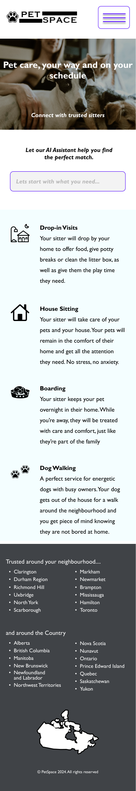
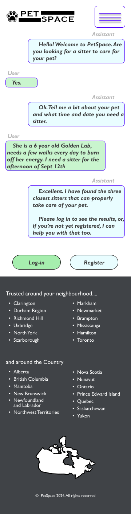
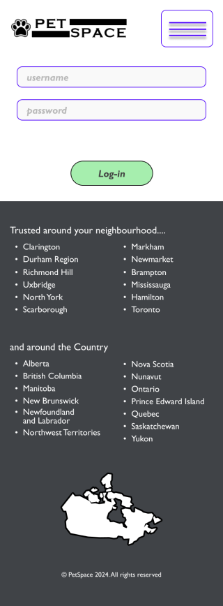
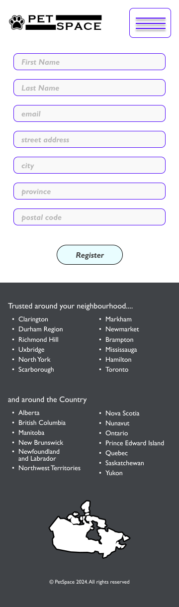
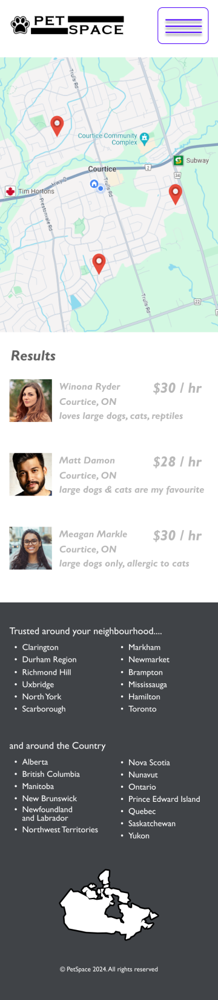
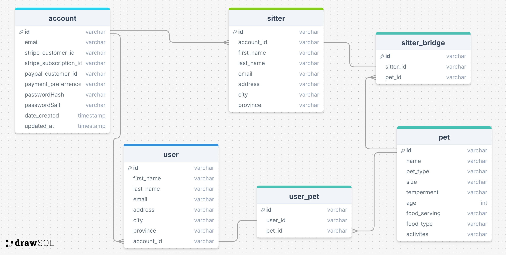

# PetSpace Capstone

PetSpace

## Overview

PetSpace

- PetSpace is a portal to connect users so they can:
- 1. Find a pet-sitter for any length of time ranging from 30 mins to multiple days or
- 2. To offer their services to be a pet-sitter.

### Problem

Many times me and my girlfriend have needed, or wanted, to make plans for an extended period of time away
from home, but there is always a haphazard plan about who will take care of her pets.

Most times a family member will come through and help, but there are occasions where plans have had to be
cancelled due to the unavailability of care for her pets.

PetSpace seeks to bridge the gap between people needing to have their pets cared for during emergencies, or
planned time away from home, with caring individuals that can take care of pets while their family is away.

### User Profile

Who will use your app? How will they use it? Any special considerations that your app must take into account.

-Pet Owners and Pet-sitters

- Users will be split into the following groups:
- Administrative users for upkeep of the website
- General users that will be ranked as:
  - Users
  - Sitters

### Features

- As a new user, I want to be able to create a profile as a:
- user - a person that has a pet that needs to be cared for while I'm away
- sitter - a person that takes care of pets for user's while they're away

#### User

- as a user, I want to be able to use an AI interface to help connect me to a trusted sitter
- as a user, I wasnt to see the search results displayed in a map and/or a list
- as a user, I want to be able to schedule a date and time range for a sitter to watch my pets
- as a user, I want to be able to list the types of pets that I have, special care instructions, feeding preferrences, and the type of attention I expect sitters to give to my pets.
- as a user, I want to be able to see a sitters hourly, half-day, daily, weekly & monthly rate.

#### Sitter

- as a sitter, I want to be able to search for users in need of my services
- as a sitter, I want to be able to set my rate and currency
- as a sitter, I want to be able to list the pets that I am able to care for.
  - I also want to be able to list certain pets that I cannot care for under any circumstances.

## Implementation

### Tech Stack

- React
- Javascript
- MySQL
- Express
- Client libraries:
  - react
  - react-router
  - axios
  - OpenAI for client interface
- Server libraries
  - knex
  - express
  - Bcrypt for passwords

### APIs

External API's

- Google Maps
- PayPal
- Stripe
- Amazon S3 for profile pic, pet pics, character reference, and background check document

### Sitemap

- Home page
- AI Assistant page
- login
- sign-up
- Search Result page
- user / sitter review (Nice to have)

### Mockups

#### Home Page



#### AI Assitant



#### Log-in Page



#### Register Page



#### Search Results Page



### Data



### Endpoints

List endpoints that your server will implement, including HTTP methods, parameters, and example responses.

**GET /sitters**

- Get sitters
  - sort based on pet types relevant to user pet breed
    - then sort based on availability,
    - then sort based on distance, nearest to farthest
    - display first three with option to display next three, up to 12 results

Response:

```
{
  [
    "id": 1,
    "name": "Winona Ryder",
    "availability": true, <!-- true if sitter is available for users requested data/time -->
    "distance": 1.25, <!-- unitless, but will be displayed in kilometers -->
    "city": "Courtice",
    "province": "ON",
    "pet_watch_types": "loves large dogs, cats, and reptiles"
  ],
  [
    "id": 2,
    "name": "Matt Damon",
    "availability": true, <!-- true if sitter is available for users requested data/time -->
    "distance": 2.0, <!-- unitless, but will be displayed in kilometers -->
    "city": "Courtice",
    "province": "ON",
    "pet_watch_types": "large dogs & cats are my favourite"
  ],
  [
    "id": 3,
    "name": "Meagan Markle",
    "availability": true, <!-- true if sitter is available for users requested data/time -->
    "distance": 2.25, <!-- unitless, but will be displayed in kilometers -->
    "city": "Courtice",
    "province": "ON",
    "pet_watch_types": "large dogs only, allergic to cats"
  ]
}
```

**POST /users/register**

- Add a user account

Parameters:

- user First name
- user last name
- user email
- user Street Address
- user City
- user Province
- user Postal Code
- user role, User (pet owner in need of a sitter), Sitter, Admin (for "Nice to have" use if time permits)

Response:

```
{
    "token": "seyJhbGciOiJIUzI1NiIsInR5cCI6IkpXVCJ9.eyJzdWIiOiIxMjM0NTY3ODkwIiwibmFtZSI6I..."
}
```

**POST /users/login**

- Log-in a user

Parameters:

- email: user's email
- password: user's password

Response:

```
{
    "token": "seyJhbGciOiJIUzI1NiIsInR5cCI6IkpXVCJ9.eyJzdWIiOiIxMjM0NTY3ODkwIiwibmFtZSI6I..."
}
```

### Auth

- JWT auth
  - Before adding auth, all API requests will be using a fake user with id 1
  - Added after core features have first been implemented
  - Store JWT in localStorage, remove when a user logs out
  - Add states for logged in showing different UI in places listed in mockups

## Roadmap

- Create client

  - react project with routes and boilerplate pages

- Create server

  - express project with routing, with placeholder 200 responses

- Create migrations

- Create initial 20 sitter profiles centered around Durham region

  - if time permits, add 20 sitter proflies each for Ajax, Pickering & Scarborough
  - if there is ample time, add another 20 sitter profiles each for North York, Toronto, & Richmond Hill

- Create seeds for sitter data

- Create and train AI model

- Deploy client and server projects so all commits will be reflected in production

- Feature: Home page

- Feature: AI Assistant interface

  - train AI model for user interaction to assist users in searching for sitters & registering new users
  - implement AI chat functionality

- Feature: create account

  - implement registration page + form
  - create POST /users/register endpoint

- Feature: Login

  - Implement login page + form
  - create POST /users/login endpoint

- Feature: Search Results

  - Implement search results page
  - Display 3 nearest search results on Google Maps embed
  - list the 3 results below

- Feature: Implement JWT tokens

  - Server: Update expected requests / responses on protected endpoints
  - Client: Store JWT in local storage, include JWT on axios calls

- Bug fixes

- Demo Day

## Nice-to-haves

### Admin profile / page / rights

- as an admin, I want to be able to review / approve / not approve an application from a potential sitter
  - as part of the review process, I want to be able to view the character reference and background check
- as an admin, I want to be able to suspend or remove users / sitters that have violated the terms of use of the app
  - Terms of Service will need to be fleshed out
- as an admin, I want to be able to remove user / sitter reviews that violate proper decorum, ie: verbal abuse, profanity

### User profile / rights

- as a user, I want to be able to edit my profile, including my payment method
- as a user, I want to be able to have multiple payment options including cash, debit, credit, PayPal, and maybe a few crypto options
- as a user, I want to be able to set the rate I'm willing to pay, or provide a budget for my time away and let sitters bid on my request.
- as a user, I want to be able to rate the care that a sitter gave so that other users can make informed decisions about sitters
- as a user, I want to be able to view the ratings of a sitter, as well as their initial character references.

### Sitter profile / rights

- as a sitter, I want to be able to edit my profile, including my method of accepting payment
- as a sitter, I want to be able to block off time during the week that I am not available, and also highlight a block of time where I am available for emergency pet-sitting
- as a sitter, I want to be able to bid on a user's request
- as a sitter, I want to be able to quickly upload any character references or background checks (background checks to be submitted for human verification but will not be retained).

### Extra Endpoints

**Get /sitters/:id**

- get sitter by id
  - view their ratings
  - optional token with JWT to add user rating only if sitter has provided a service to the user

Parameters:

- id: sitter id
- token: JWT of the logged in user

**POST /sitter/:id/rating**

- logged in user can add their rating to sitter profile
  - only if sitter has provided a service to the user

Parameters:

- id: sitter id
- token: JWT of the logged in user
- rating: number rating out of 5 with increments of 0.5 points

**PUT /sitter/:id/rating**

- logged in user can update their rating of a sitter

Parameters:

- id: sitter id
- token: JWT of the logged in user
- rating: number rating out of 5 with increments of 0.5 points

## Project Kickoff

- slight modification to bridge table naming
